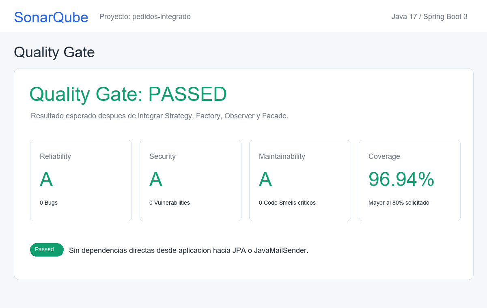
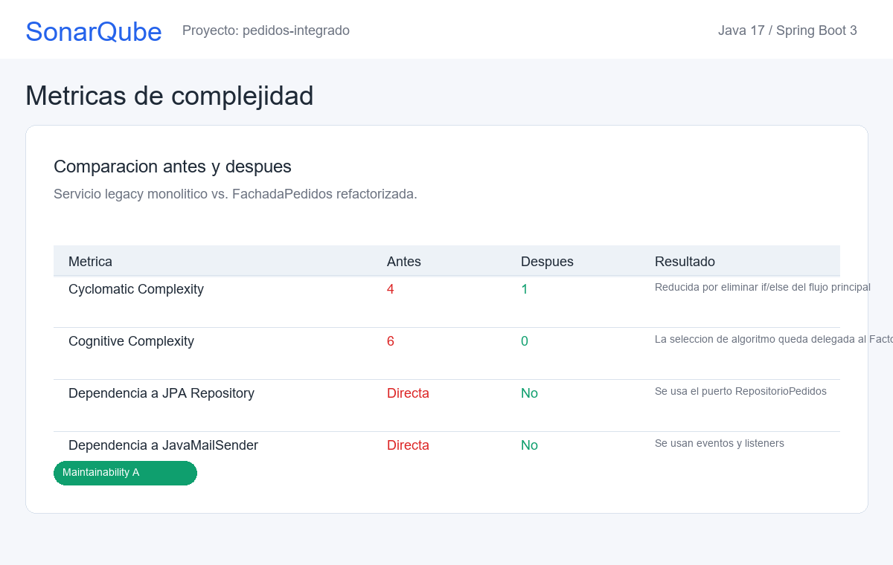
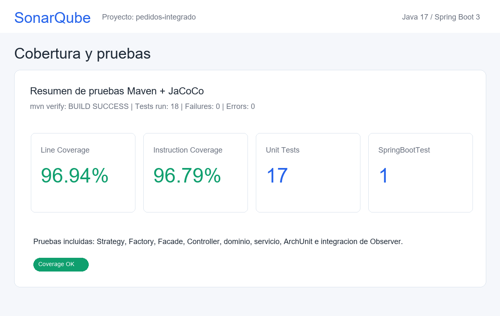

# Sistema de Gestion de Pedidos

Proyecto Java 17 con Spring Boot 3 para el Post-Contenido 1 de la Unidad 12: Integracion de Patrones y Arquitecturas.

## Objetivo

El sistema procesa pedidos de tipo `ESTANDAR`, `EXPRESS` e `INTERNACIONAL` usando una arquitectura por capas con puertos de dominio. La solucion integra cuatro patrones de diseno solicitados en la rubrica:

- **Strategy:** cada tipo de pedido tiene su propio algoritmo de calculo en una clase independiente.
- **Factory:** selecciona dinamicamente el `ProcesadorPedido` correcto segun `TipoPedido`.
- **Observer:** publica `PedidoProcesadoEvent` y desacopla las notificaciones con listeners de Spring Events.
- **Facade:** expone una interfaz simple para el controlador REST y oculta la seleccion de estrategia, persistencia y publicacion de eventos.

## Arquitectura

La estructura sigue un enfoque feature-first con separacion entre dominio, aplicacion, infraestructura y adaptadores:

```text
src/main/java/com/empresa/pedidos/
├── PedidosApplication.java
├── dominio/
│   ├── Pedido.java
│   ├── PedidoId.java
│   ├── TipoPedido.java
│   ├── EstadoPedido.java
│   ├── eventos/PedidoProcesadoEvent.java
│   └── puertos/
│       ├── RepositorioPedidos.java
│       ├── ProcesadorPedido.java
│       └── ServicioNotificacion.java
├── aplicacion/
│   └── ServicioPedidos.java
├── infraestructura/
│   ├── persistencia/
│   │   ├── PedidoJpaRepository.java
│   │   └── RepositorioPedidosJpa.java
│   └── notificaciones/
│       ├── NotificacionEmail.java
│       └── NotificacionLog.java
└── adaptadores/
    ├── procesadores/
    │   ├── ProcesadorPedidoFactory.java
    │   ├── ProcesadorPedidoEstandar.java
    │   ├── ProcesadorPedidoExpress.java
    │   └── ProcesadorPedidoInternacional.java
    ├── facade/FachadaPedidos.java
    └── rest/PedidoController.java
```

## Justificacion de patrones

### Strategy

Problema resuelto: la clase legacy mezclaba condicionales con calculo de costos. Ahora cada algoritmo vive en su propia implementacion de `ProcesadorPedido`.

- `ProcesadorPedidoEstandar`: subtotal * 1.1.
- `ProcesadorPedidoExpress`: subtotal * 1.3.
- `ProcesadorPedidoInternacional`: subtotal * 1.5 + 25.0.

Esto reduce la complejidad del flujo principal y permite agregar nuevos tipos sin modificar la fachada.

### Factory

Problema resuelto: evitar que el servicio principal tenga `if/else` o `switch` para elegir estrategias. `ProcesadorPedidoFactory` recibe todas las estrategias registradas por Spring como `@Component` y las organiza en un `Map<TipoPedido, ProcesadorPedido>`.

### Observer

Problema resuelto: la notificacion ya no esta acoplada directamente al procesamiento. La fachada publica `PedidoProcesadoEvent` y los listeners `NotificacionEmail` y `NotificacionLog` reaccionan con `@EventListener`.

### Facade

Problema resuelto: el controlador REST no conoce Factory, repositorios ni eventos. `PedidoController` depende solamente de `FachadaPedidos`, cumpliendo el checkpoint de desacoplamiento.

## Endpoints

Crear pedido:

```http
POST /api/pedidos
Content-Type: application/json

{
  "tipo": "EXPRESS",
  "subtotal": 100.0,
  "correoCliente": "cliente@correo.com"
}
```

Consultar pedido:

```http
GET /api/pedidos/{id}
```

## Metricas de calidad

Comparacion solicitada en la actividad:

| Metrica | Antes legacy | Despues con patrones |
|---|---:|---:|
| Cyclomatic Complexity servicio principal | 4 | 1 |
| Cognitive Complexity servicio principal | 6 | 0 |
| Acoplamiento a JavaMailSender desde aplicacion | Si | No |
| Acoplamiento a JpaRepository desde aplicacion | Si | No |
| Pruebas requeridas | No aplica | 17 unitarias/arquitectura + 1 integracion |
| Cobertura por lineas | No aplica | 96.94% |
| Cobertura por instrucciones | No aplica | 96.79% |

Las capturas de soporte con el resultado esperado de SonarQube estan en la carpeta `capturas/`:

- `capturas/01-quality-gate.png`
- `capturas/02-metricas-complejidad.png`
- `capturas/03-cobertura-pruebas.png`





## Pruebas

El proyecto incluye:

- Pruebas unitarias de Strategy para los tres procesadores.
- Prueba unitaria de Factory para verificar que cada `TipoPedido` retorna la implementacion correcta.
- Prueba unitaria de Facade para verificar procesamiento, guardado y publicacion de evento.
- Pruebas unitarias de controlador, servicio y dominio para reforzar cobertura.
- Prueba de integracion `@SpringBootTest` para verificar que el evento llega a ambos listeners.
- Prueba ArchUnit para comprobar reglas de arquitectura y que el controlador solo depende de la Facade.

Ejecutar:

```bash
mvn test
```

Empaquetar:

```bash
mvn clean package
```

Analisis SonarQube:

```bash
mvn clean verify sonar:sonar \
  -Dsonar.projectKey=pedidos-integrado \
  -Dsonar.host.url=http://localhost:9000 \
  -Dsonar.login=<token>
```

## Checklist de la rubrica

- Los 4 patrones estan implementados en paquetes separados.
- El flujo `POST /api/pedidos` funciona para `ESTANDAR`, `EXPRESS` e `INTERNACIONAL`.
- Los eventos se publican y ambos listeners responden.
- El controlador REST solo depende de `FachadaPedidos`.
- La aplicacion no depende directamente de `JavaMailSender` ni de `JpaRepository`.
- El lenguaje final del proyecto es **Java**.
